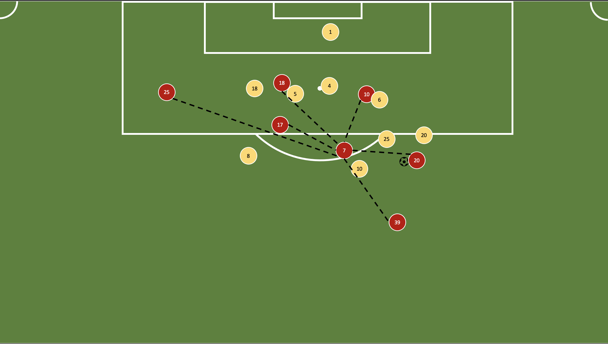

# Match-To-Networks

## Match feed converted to networks in real time for analysis

***

If suppose, this is the match frame : 

The graph state of the frame generated will be something like this : 

***

Higher level steps : 

1. Achieve network generation from one frame of the match.
2. Achieve network generation for each frame in the whole match.
3. Achieve network generation from match feed in real - time.
